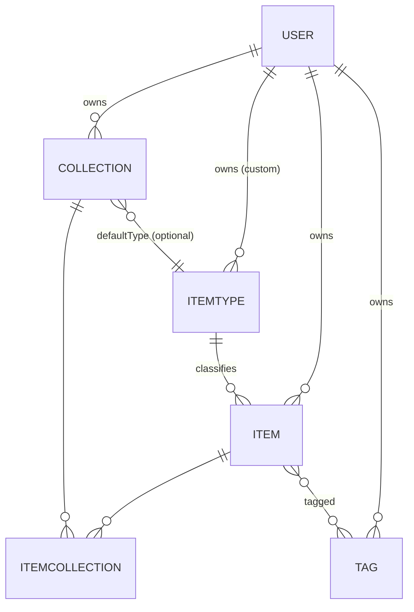
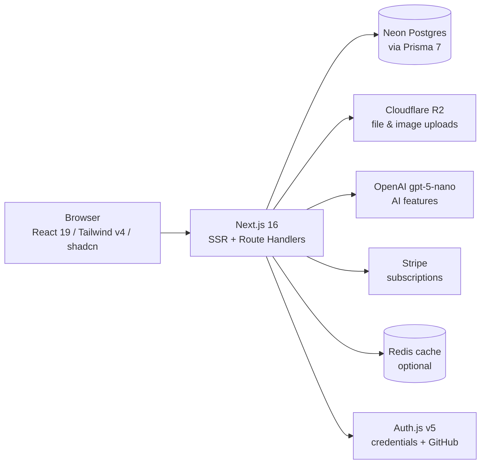
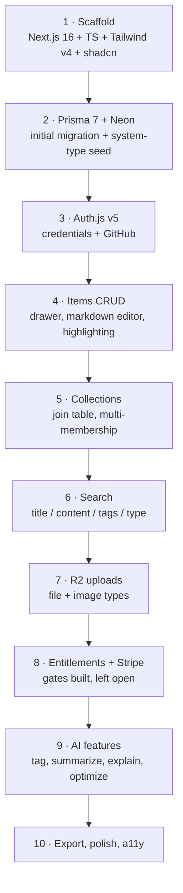

# 🗃️ DevStash — Project Overview

> **One fast, searchable, AI-enhanced hub for all developer knowledge & resources.**

| | |
|---|---|
| **Product** | DevStash |
| **Type** | Freemium SaaS (web) |
| **Stack** | Next.js 16 · React 19 · TypeScript · Postgres (Neon) · Prisma 7 · Auth.js v5 · Tailwind v4 + shadcn/ui |
| **Status** | Planning / foundation |

---

## 1. Problem

Developers keep their essentials scattered across too many tools:

| Asset | Where it lives today |
|---|---|
| Code snippets | VS Code, Notion |
| AI prompts | Chat histories |
| Context files | Buried in project folders |
| Useful links | Browser bookmarks |
| Docs | Random folders |
| Commands | `.txt` files, `~/.bash_history` |
| Project templates | GitHub Gists |

The result: **context switching, lost knowledge, and inconsistent workflows.**

DevStash consolidates all of it into a single searchable store with an AI layer on top.

---

## 2. Target Users

| Persona | Primary need |
|---|---|
| 🧑‍💻 **Everyday Developer** | Fast grab-and-go for snippets, commands, links |
| 🤖 **AI-first Developer** | Store prompts, contexts, workflows, system messages |
| 🎥 **Content Creator / Educator** | Code blocks, explanations, course notes |
| 🏗️ **Full-stack Builder** | Patterns, boilerplates, API examples |

---

## 3. Features

### A. Items & Item Types

Every stashed thing is an **Item**, classified by an **ItemType**. Users will eventually create custom types; we ship with locked **system types**:

| Type | Content kind | Color | Icon (lucide) | Tier |
|---|---|---|---|---|
| `snippet` | text | `#3b82f6` blue | `Code` | Free |
| `prompt` | text | `#8b5cf6` purple | `Sparkles` | Free |
| `note` | text | `#fde047` yellow | `StickyNote` | Free |
| `command` | text | `#f97316` orange | `Terminal` | Free |
| `link` | url | `#10b981` emerald | `Link` | Free |
| `file` | file | `#6b7280` gray | `File` | **Pro** |
| `image` | file | `#ec4899` pink | `Image` | **Pro** |

- Each type resolves to a **content kind**: `text` · `url` · `file`.
- Routes are type-scoped and plural: `/items/snippets`, `/items/prompts`, `/items/links`, …
- Items are created and opened in a **quick-access drawer** — never a full page navigation.

### B. Collections

- A collection holds items of **any** type.
- An item can belong to **multiple collections** (e.g. a React snippet in both *React Patterns* and *Interview Prep*) — modeled via the `ItemCollection` join table.
- Examples: *React Patterns* (snippets, notes) · *Context Files* (files) · *Python Snippets* (snippets).

### C. Search

Full-text search across **content · title · tags · type**. Free tier gets basic search.

### D. Authentication

Auth.js (NextAuth) v5 — **email/password** and **GitHub OAuth**.

### E. Quality-of-life

- ⭐ Favorite items and collections
- 📌 Pin items to top
- 🕘 Recently used
- 📥 Import code from a file
- ✍️ Markdown editor for text types (with syntax highlighting)
- ☁️ File upload for `file` / `image` types (Cloudflare R2)
- 📤 Export data in multiple formats
- 🌙 Dark mode by default
- 🔀 Add/remove items to/from multiple collections, and view an item's collection memberships

### F. AI Features (Pro)

- 🏷️ Auto-tag suggestions
- 📝 Summaries
- 💡 Explain This Code
- ⚡ Prompt optimizer

Model: **OpenAI `gpt-5-nano`**, called from Next.js route handlers.

---

## 4. Data Model

### Entity relationships



> `ItemType.userId` is `null` for the seven system types — they are global and immutable (`isSystem = true`).

### Prisma schema (draft)

```prisma
// prisma/schema.prisma
generator client {
  provider = "prisma-client"
  output   = "../src/generated/prisma"
}

datasource db {
  provider = "postgresql"
  url      = env("DATABASE_URL")
}

enum ContentKind {
  TEXT
  URL
  FILE
}

model User {
  id            String    @id @default(cuid())
  name          String?
  email         String    @unique
  emailVerified DateTime?
  image         String?
  passwordHash  String? // null for OAuth-only accounts

  // Billing
  isPro                Boolean   @default(false)
  stripeCustomerId     String?   @unique
  stripeSubscriptionId String?   @unique
  proUntil             DateTime?

  accounts    Account[]
  sessions    Session[]
  items       Item[]
  collections Collection[]
  itemTypes   ItemType[] // custom types only
  tags        Tag[]

  createdAt DateTime @default(now())
  updatedAt DateTime @updatedAt
}

model ItemType {
  id       String      @id @default(cuid())
  name     String // "snippet", "prompt", ...
  slug     String // "snippets" -> /items/snippets
  kind     ContentKind @default(TEXT)
  icon     String // lucide icon name, e.g. "Code"
  color    String // hex, e.g. "#3b82f6"
  isSystem Boolean     @default(false)
  isPro    Boolean     @default(false)

  userId String? // null => system type
  user   User?   @relation(fields: [userId], references: [id], onDelete: Cascade)

  items              Item[]
  defaultCollections Collection[] @relation("CollectionDefaultType")

  createdAt DateTime @default(now())

  @@unique([userId, name])
  @@unique([userId, slug])
}

model Item {
  id          String  @id @default(cuid())
  title       String
  description String?

  contentKind ContentKind @default(TEXT)
  content     String? // text body (markdown / code); null for file items
  language    String? // syntax highlighting hint, e.g. "tsx"
  url         String? // for link types
  fileUrl     String? // Cloudflare R2 URL
  fileName    String?
  fileSize    Int? // bytes

  isFavorite Boolean   @default(false)
  isPinned   Boolean   @default(false)
  lastUsedAt DateTime?

  userId String
  user   User   @relation(fields: [userId], references: [id], onDelete: Cascade)

  itemTypeId String
  itemType   ItemType @relation(fields: [itemTypeId], references: [id])

  collections ItemCollection[]
  tags        Tag[]

  createdAt DateTime @default(now())
  updatedAt DateTime @updatedAt

  @@index([userId, itemTypeId])
  @@index([userId, isPinned, updatedAt])
  @@index([userId, lastUsedAt])
}

model Collection {
  id          String  @id @default(cuid())
  name        String
  description String?
  isFavorite  Boolean @default(false)

  // Used to color a collection card before it holds any items
  defaultTypeId String?
  defaultType   ItemType? @relation("CollectionDefaultType", fields: [defaultTypeId], references: [id])

  userId String
  user   User   @relation(fields: [userId], references: [id], onDelete: Cascade)

  items ItemCollection[]

  createdAt DateTime @default(now())
  updatedAt DateTime @updatedAt

  @@unique([userId, name])
  @@index([userId, updatedAt])
}

model ItemCollection {
  itemId       String
  collectionId String
  addedAt      DateTime @default(now())

  item       Item       @relation(fields: [itemId], references: [id], onDelete: Cascade)
  collection Collection @relation(fields: [collectionId], references: [id], onDelete: Cascade)

  @@id([itemId, collectionId])
  @@index([collectionId, addedAt])
}

model Tag {
  id   String @id @default(cuid())
  name String

  userId String
  user   User   @relation(fields: [userId], references: [id], onDelete: Cascade)

  items Item[]

  createdAt DateTime @default(now())

  @@unique([userId, name])
}

// --- Auth.js v5 adapter models ---

model Account {
  userId            String
  type              String
  provider          String
  providerAccountId String
  refresh_token     String?
  access_token      String?
  expires_at        Int?
  token_type        String?
  scope             String?
  id_token          String?
  session_state     String?

  user User @relation(fields: [userId], references: [id], onDelete: Cascade)

  @@id([provider, providerAccountId])
}

model Session {
  sessionToken String   @id
  userId       String
  expires      DateTime
  user         User     @relation(fields: [userId], references: [id], onDelete: Cascade)
}

model VerificationToken {
  identifier String
  token      String
  expires    DateTime

  @@id([identifier, token])
}
```

**Open decisions**
- Tags are **per-user** here (`@@unique([userId, name])`) so one user's taxonomy can't collide with another's. Alternative: global tags + a user-scoped join.
- `ItemCollection` uses a composite PK rather than its own `id` — prevents duplicate memberships for free.
- Full-text search: start with Postgres `tsvector` + a GIN index (added in a migration); revisit only if it stops scaling.

---

## 5. Tech Stack



| Layer | Choice | Notes |
|---|---|---|
| Framework | [Next.js 16](https://nextjs.org/docs) / React 19 | SSR pages with dynamic components; route handlers for the backend. Single repo. |
| Language | TypeScript | Strict mode |
| DB | [Neon](https://neon.tech/docs) Postgres | Serverless, cloud |
| ORM | [Prisma 7](https://www.prisma.io/docs) | Fetch the latest docs before scaffolding — v7 changed generator output & client import paths |
| Cache | Redis | Optional / later |
| Storage | [Cloudflare R2](https://developers.cloudflare.com/r2/) | Presigned uploads |
| Auth | [Auth.js v5](https://authjs.dev) | Email+password, GitHub OAuth |
| AI | [OpenAI](https://platform.openai.com/docs) `gpt-5-nano` | Server-side only |
| Payments | [Stripe](https://docs.stripe.com/billing) | Checkout + webhooks |
| UI | [Tailwind v4](https://tailwindcss.com/docs) + [shadcn/ui](https://ui.shadcn.com) | |
| Icons | [lucide-react](https://lucide.dev/icons) | Type icons stored by name |

> ⚠️ **Migration policy:** never use `prisma db push` or hand-edit the database. Every schema change ships as a checked-in migration, applied in dev first, then prod.

---

## 6. Monetization

Freemium. Pro is **$8/month** or **$72/year** (~25% off).

| | Free | Pro |
|---|---|---|
| Items | 50 total | Unlimited |
| Collections | 3 | Unlimited |
| System types | All except `file` / `image` | All |
| File & image uploads | ❌ | ✅ |
| Search | Basic | Basic |
| Custom types | ❌ | ✅ *(later)* |
| AI auto-tagging | ❌ | ✅ |
| AI code explanation | ❌ | ✅ |
| AI prompt optimizer | ❌ | ✅ |
| Export (JSON/ZIP) | ❌ | ✅ |
| Support | Community | Priority |

> 🛠️ **During development:** build the entitlement plumbing (`isPro`, limit checks, gated routes) but leave the gates open — every user gets everything until launch. Put the checks behind a single `canUse(user, feature)` helper so flipping them on is a one-line change.

---

## 7. UI / UX

### Principles
- Modern, minimal, developer-focused — reference points: **Notion, Linear, Raycast**
- Dark mode default, light mode optional
- Clean typography, generous whitespace, subtle borders and shadows
- Syntax highlighting on every code block

### Layout

```
┌────────────┬──────────────────────────────────────────┐
│  SIDEBAR   │  MAIN                                    │
│ (collapse) │                                          │
│  Snippets  │  ┌────────┐ ┌────────┐ ┌────────┐        │
│  Prompts   │  │Collect.│ │Collect.│ │Collect.│  ← bg  │
│  Commands  │  │  card  │ │  card  │ │  card  │   color│
│  Notes     │  └────────┘ └────────┘ └────────┘        │
│  Links     │                                          │
│  Files     │  ┌────────┐ ┌────────┐ ┌────────┐        │
│  Images    │  │  item  │ │  item  │ │  item  │  ← brd │
│  ───────   │  └────────┘ └────────┘ └────────┘  color │
│  Recent    │                                          │
│  Collections│                        ┌───────────────┐│
│            │                        │ item drawer   ││
└────────────┴────────────────────────┴───────────────┘┘
```

- **Sidebar:** item types (linking to `/items/<slug>`) + latest collections
- **Main:** grid of collection cards, **background color** derived from the type most represented in that collection (falling back to `defaultTypeId`); items render below in cards with a type-colored **border**
- **Item drawer:** individual items open in a fast drawer, not a page

### Responsive
Desktop-first, mobile usable. Sidebar collapses into a drawer under `md`.

### Micro-interactions
Smooth transitions · hover states on cards · toast notifications for actions · loading skeletons

---

## 8. Suggested Build Order



---

## 9. Open Questions

- Is Redis actually needed at launch, or is Next.js caching + Neon enough?
- Search: Postgres full-text vs. a dedicated index — where's the cutoff?
- Do collection card colors recompute on every write, or get denormalized onto `Collection`?
- Export scope: whole account only, or per-collection too?
- Soft delete / trash for items, or hard delete?